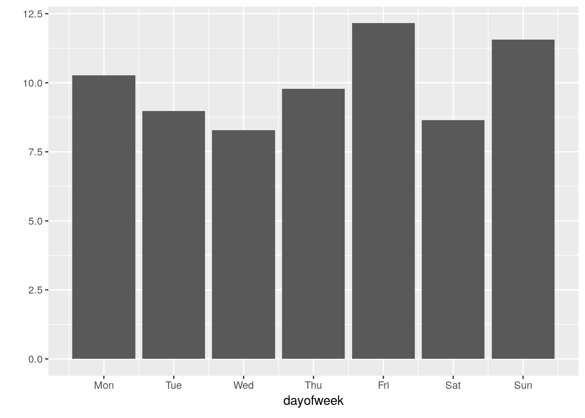
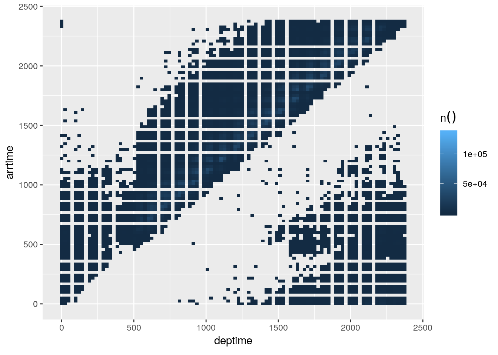

# Data Visualizations


## Simple plot
*Practice pushing the calculations to the database*

1. Use `collect()` bring back the aggregated results into a "pass-through" variable called `by_month`

```r
by_month <- flights %>%
  group_by(month) %>%
  tally() %>%
  mutate(n = as.numeric(n)) %>%
  collect() 

head(by_month)
```

```
## # A tibble: 6 x 2
##   month      n
##   <dbl>  <dbl>
## 1     1 605765
## 2     2 569236
## 3     3 616090
## 4     4 598126
## 5     5 606293
## 6     6 608665
```

2. Plot results using `ggplot2`


```r
library(ggplot2)

ggplot(by_month) +
  geom_line(aes(x = month, y = n)) 
```


## Plot in one code segment
*Practice going from `dplyr` to `ggplot2` without using pass-through variable, great for EDA*

1. Using the code from the previous section, create a single piped code set which also creates the plot

```r
flights %>%
  group_by(month) %>%
  tally() %>%
  mutate(n = as.numeric(n)) %>%
  collect() %>%
  ggplot() +                        # < Don't forget to switch to `+`
  geom_line(aes(x = month, y = n)) 
```


2. Change the aggregation to the average of `arrdelay`.  Tip: Use `x` as the summarize variable 

```r
flights %>%
  group_by(month) %>%
  summarise(x = mean(arrdelay, na.rm = TRUE)) %>%
  mutate(x = as.numeric(x)) %>%
  collect() %>%
  ggplot() +
  geom_line(aes(x = month, y = x)) 
```


3. Plot the average distance. Copy the code from the previous exercise and change the variable

```r
flights %>%
  group_by(month) %>%
  summarise(x = mean(distance, na.rm = TRUE)) %>%
  mutate(x = as.numeric(x)) %>%
  collect() %>%
  ggplot() +
  geom_line(aes(x = month, y = x)) 
```


## Plot specific data segments
*Combine skills from previous units to create more sophisticated plots*

1. Start with getting the top 5 carriers

```r
flights %>%
  group_by(uniquecarrier) %>%
  tally() %>%
  arrange(desc(n)) %>%
  head(5) 
```

```
## # Source:     lazy query [?? x 2]
## # Database:   postgres [rstudio_dev@localhost:/postgres]
## # Ordered by: desc(n)
##   uniquecarrier n              
##   <chr>         <S3: integer64>
## 1 WN            1201754        
## 2 AA             604885        
## 3 OO             567159        
## 4 MQ             490693        
## 5 US             453589
```

2. Pipe the top 5 carriers to a plot

```r
flights %>%
  group_by(uniquecarrier) %>%
  tally() %>%
  mutate(n = as.numeric(n)) %>%
  arrange(desc(n)) %>%
  head(5) %>%
  collect() %>%
  ggplot() +
    geom_col(aes(x = uniquecarrier, y = n))
```


3. Improve the plot's look

```r
flights %>%
  group_by(uniquecarrier) %>%
  tally() %>%
  mutate(n = as.numeric(n)) %>%
  arrange(desc(n)) %>%
  head(5) %>%
  collect() %>%
  ggplot() +      #Don't forget to switch to `+`
    geom_col(aes(x = uniquecarrier, y = n, fill = n)) +  #Add fill
    theme(legend.position="none") +    # Turn legend off
    coord_flip() +  # Rotate cols into rows
    labs(title = "Top 5 Carriers", 
         subtitle = "Source: Datawarehouse",
         x = "Carrier Name", 
         y = "# of Flights")
```


## Two or more queries
*Learn how to use `pull()` to pass a set of values to be used on a secondary query*

1. Use `pull()` to get the top 5 carriers loaded in a vector

```r
top5 <- flights %>%
  group_by(uniquecarrier) %>%
  tally() %>%
  arrange(desc(n)) %>%
  head(5) %>%
  pull(uniquecarrier)

top5
```

```
## [1] "WN" "AA" "OO" "MQ" "US"
```

2. Use `%in%` to pass the `top5` vector to a filter

```r
flights %>%
  filter(uniquecarrier %in% top5) 
```

```
## # Source:   lazy query [?? x 31]
## # Database: postgres [rstudio_dev@localhost:/postgres]
##    flightid  year month dayofmonth dayofweek deptime crsdeptime arrtime
##       <int> <dbl> <dbl>      <dbl>     <dbl>   <dbl>      <dbl>   <dbl>
##  1  3654535  2008     7         18         5     641        645     726
##  2  3654536  2008     7         18         5    1304       1305    1341
##  3  3654537  2008     7         18         5    1938       1755    2018
##  4  3654538  2008     7         18         5    1935       1935    2127
##  5  3654539  2008     7         18         5     959       1000    1158
##  6  3654540  2008     7         18         5    1531       1530    1651
##  7  3654541  2008     7         18         5     826        830    1016
##  8  3654542  2008     7         18         5    1045       1045    1356
##  9  3654543  2008     7         18         5    1502       1405    2025
## 10  3654544  2008     7         18         5     959       1000    1001
## # ... with more rows, and 23 more variables: crsarrtime <dbl>,
## #   uniquecarrier <chr>, flightnum <dbl>, tailnum <chr>,
## #   actualelapsedtime <dbl>, crselapsedtime <dbl>, airtime <dbl>,
## #   arrdelay <dbl>, depdelay <dbl>, origin <chr>, dest <chr>,
## #   distance <dbl>, taxiin <dbl>, taxiout <dbl>, cancelled <dbl>,
## #   cancellationcode <chr>, diverted <dbl>, carrierdelay <dbl>,
## #   weatherdelay <dbl>, nasdelay <dbl>, securitydelay <dbl>,
## #   lateaircraftdelay <dbl>, score <int>
```

3. Group by carrier and get the average arrival delay

```r
flights %>%
  filter(uniquecarrier %in% top5) %>%
  group_by(uniquecarrier) %>%
  summarise(n = mean(arrdelay, na.rm = TRUE))
```

```
## # Source:   lazy query [?? x 2]
## # Database: postgres [rstudio_dev@localhost:/postgres]
##   uniquecarrier     n
##   <chr>         <dbl>
## 1 AA            12.6 
## 2 MQ             9.89
## 3 OO             6.60
## 4 US             2.85
## 5 WN             5.18
```

4. Copy the final `ggplot()` code from the *Plot specific segment* section. Update the `y` labs.

```r
flights %>%
  filter(uniquecarrier %in% top5) %>%
  group_by(uniquecarrier) %>%
  summarise(n = mean(arrdelay, na.rm = TRUE)) %>%
  # From previous section ----------------------------------------------
  collect() %>%
  ggplot() +      #Don't forget to switch to `+`
    geom_col(aes(x = uniquecarrier, y = n, fill = n)) +  #Add fill
    theme(legend.position="none") +    # Turn legend off
    coord_flip() +  # Rotate cols into rows
    labs(title = "Top 5 Carriers", 
         subtitle = "Source: Datawarehouse",
         x = "Carrier Name", 
         y = "Average Delay") 
```


## Visualize using `dbplot`
*Review how to use `dbplot` to make it easier to plot with databases*

1. Install and load `dbplot`

```r
library(dbplot)
```

2. Create a line plot using the helper function `dbplot_line()`


```r
flights %>%
  dbplot_line(month)
```

```
## Don't know how to automatically pick scale for object of type integer64. Defaulting to continuous.
```

```
## Warning: Removed 12 rows containing missing values (geom_path).
```


3. Update the plot's labels

```r
flights %>%
  dbplot_line(month) +
  labs(title = "Monthly flights",
       x = "Month",
       y = "Number of flights") 
```

```
## Don't know how to automatically pick scale for object of type integer64. Defaulting to continuous.
```

```
## Warning: Removed 12 rows containing missing values (geom_path).
```


## Plot a different aggregation
*`dbplot` allows for aggregate functions, other than record count, to be used for plotting*

1. Plot the average departure delay by day of week

```r
flights %>%
  dbplot_bar(dayofweek, mean(depdelay, na.rm = TRUE))
```


2. Change the day numbers to day name labels

```r
flights %>%
  dbplot_bar(dayofweek, mean(depdelay, na.rm = TRUE)) +
  scale_x_continuous(
    labels = c("Mon", "Tue", "Wed", "Thu", "Fri", "Sat", "Sun"),
    breaks = 1:7
  )
```




## Create a histogram
*Use the package's function to easily create a histogram*


1. Use the `dbplot_histogram()` to build the histogram

```r
flights %>%
  dbplot_histogram(distance)
```

```
## Don't know how to automatically pick scale for object of type integer64. Defaulting to continuous.
```

```
## Warning: Removed 27 rows containing missing values (position_stack).
```


2. Adjust the `binwidth` to 300


```r
flights %>%
  dbplot_histogram(distance, binwidth = 300)
```

```
## Don't know how to automatically pick scale for object of type integer64. Defaulting to continuous.
```

```
## Warning: Removed 16 rows containing missing values (position_stack).
```


## Raster plot

1. Use a `dbplot_raster()` to visualize `deptime` versus `depdelay`

```r
flights %>%
  dbplot_raster(deptime, arrtime)
```

```
## Warning: Removed 83 rows containing missing values (geom_raster).
```



2. Change the plot's resolution to 500

```r
flights %>%
  dbplot_raster(deptime, arrtime, resolution = 500)
```

```
## Warning: Removed 293 rows containing missing values (geom_raster).
```


## Using the `calculate` functions

1. Use the `db_comptue_raster()` function to get the underlying results that feed the plot

```r
departure <- flights %>%
  db_compute_raster(deptime, arrtime)

departure
```

```
## # A tibble: 3,602 x 3
##    deptime arrtime  `n()`
##      <dbl>   <dbl>  <dbl>
##  1     NA      NA  136246
##  2   1057.   1848.     60
##  3    625.    841.  12271
##  4    697.   1392.    608
##  5    817.   1105.  13782
##  6    721.   1248.    543
##  7    649.   1488.    552
##  8   1512.   2256.     59
##  9    601.    649.   5476
## 10   1680.   2112.    309
## # ... with 3,592 more rows
```

2. Plot the results "manually"

```r
departure %>%
  filter(`n()` > 1000) %>%
  ggplot() +
  geom_raster(aes(x = deptime, y = arrtime, fill = `n()`))
```

```
## Warning: Removed 1 rows containing missing values (geom_raster).
```


## Under the hood (II)
*Review how `dbplot` pushes histogram and raster calculations to the database*

1. Use the `db_bin()` command to see the resulting tidy eval formula

```r
db_bin(field)
```

```
## (((max(field, na.rm = TRUE) - min(field, na.rm = TRUE))/30) * 
##     ifelse(as.integer(floor((field - min(field, na.rm = TRUE))/((max(field, 
##         na.rm = TRUE) - min(field, na.rm = TRUE))/30))) == 30, 
##         as.integer(floor((field - min(field, na.rm = TRUE))/((max(field, 
##             na.rm = TRUE) - min(field, na.rm = TRUE))/30))) - 
##             1, as.integer(floor((field - min(field, na.rm = TRUE))/((max(field, 
##             na.rm = TRUE) - min(field, na.rm = TRUE))/30))))) + 
##     min(field, na.rm = TRUE)
```

2. Use `trasnlate_sql()` and `simulate_odbc_postgresql()` to see an example of what the resulting SQL statement looks like

```r
translate_sql(!! db_bin(field), con = simulate_odbc_postgresql())
```

```
## <SQL> (((max(`field`) OVER () - min(`field`) OVER ()) / 30.0) * CASE WHEN (CAST(FLOOR((`field` - min(`field`) OVER ()) / ((max(`field`) OVER () - min(`field`) OVER ()) / 30.0)) AS INTEGER) = 30.0) THEN (CAST(FLOOR((`field` - min(`field`) OVER ()) / ((max(`field`) OVER () - min(`field`) OVER ()) / 30.0)) AS INTEGER) - 1.0) WHEN NOT(CAST(FLOOR((`field` - min(`field`) OVER ()) / ((max(`field`) OVER () - min(`field`) OVER ()) / 30.0)) AS INTEGER) = 30.0) THEN (CAST(FLOOR((`field` - min(`field`) OVER ()) / ((max(`field`) OVER () - min(`field`) OVER ()) / 30.0)) AS INTEGER)) END) + min(`field`) OVER ()
```

3. Disconnect from the database


```r
dbDisconnect(con)
```
